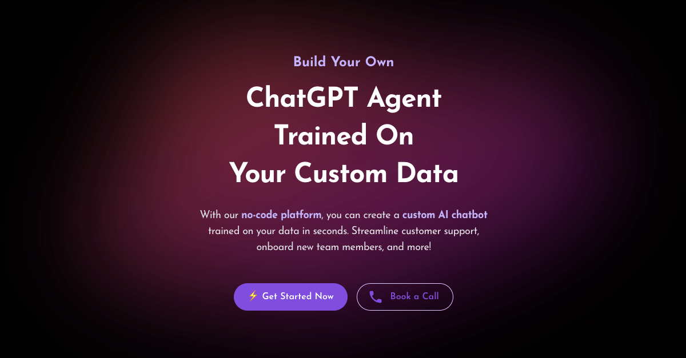

<h1 align="center" style="font-weight: bold">
  <br>
  <a href="https://chaindesk.ai"></a>
  <br>
  Chaindesk
  <br>
    <h3 align="center">The no-code platform for building custom LLM Agents</h3>
  <br>
  
</h1>

<!-- <h4 align="center">The no-code platform for semantic search and retrieval of personal or organizational documents.</h4> -->

<h2 align="center">

</h2>

**[Chaindesk](https://chaindesk.ai)** provides a user-friendly solution to quickly setup a semantic search system over your personal data without any technical knowledge.

### [📄 Documentation](https://docs.chaindesk.ai/)

### Features

- Load data from anywhere
  - Raw text
  - Web page
  - Files
    - Word
    - Excel
    - Powerpoint
    - PDF
    - Markdown
    - Plain Text
  - Web Site (coming soon)
  - Notion (coming soon)
  - Airtable (coming soon)
- No-code: User-friendly interface to manage your datastores and chat with your data
- Securized API endpoint for querying your data
- Auto sync data sources (coming soon)
- **Auto generates a ChatGPT Plugin** for each datastore

### Semantic Search Specs

- Vector Datbase: Qdrant
- Embeddigs: Openai's text-embedding-ada-002
- Chunk size: 256 tokens

### Stack

- Next.js
- Joy UI
- LangchainJS
- PostgreSQL
- Prisma
- Qdrant

Inspired by the [ChatGPT Retrieval Plugin](https://github.com/openai/chatgpt-retrieval-plugin).

### Run the project locally (Non-docker)
##### P.S.: Docker is recommended either way for Qdrant. Qdrant is much easier to install using [Docker](https://github.com/rhijjawi/docker-installer)
#### Minimum requirements:

- [Node.js v18](https://www.digitalocean.com/community/tutorials/how-to-install-node-js-on-ubuntu-20-04#option-3-installing-node-using-the-node-version-manager)
- [Postgres Database](https://www.digitalocean.com/community/tutorials/how-to-install-postgresql-on-ubuntu-20-04-quickstart)
- [Redis](https://www.digitalocean.com/community/tutorials/how-to-install-and-secure-redis-on-ubuntu-20-04)
- [Qdrant](https://qdrant.tech/documentation/quick-start/#quickstart)
- [GitHub App](https://github.com/settings/applications/) (NextAuth, easiest)
- Email Provider (NextAuth, but not required for personal use)
- [OpenAI API Key](https://platform.openai.com)
- [AWS S3 Credentials](https://aws.amazon.com/s3/)

#### Instructions:
```bash
git clone https://github.com/gmpetrov/databerry.git
```
```bash
cd databerry/
```

```bash
mv .env.example .env
```
1. After running the above commands, populate the .env file with the appropriate variables that you've obtatined
2. [Generate]((https://generate-secret.vercel.app)) two secrets for the `NEXTAUTH_SECRET` and `QDRANT_API_KEY` environment variables
```bash
openssl rand -base64 32
#returns something like: Ie2FR+o... (32 characters)
```
3. Run databerry using NPM and set hostname to your Machine/VM/Computer's IP 
```bash
#Local
npx next dev
#Virtual Machine or Remote Computer
npx next dev -H MACHINE_IP
```


<!-- ```bash
# Create .env.local
cp .env.example .env.local

# Install dependencies
pnpm install

# Generate DB tables
pnpm prisma:migrate:dev

# Run server
pnpm dev

# Run worker process
pnpm worker:datasource-loader

# or pnpm dev:all
``` -->

<!-- #### With docker compose -->

<!-- First `cd .dev/databerry` then populate the config files `app.env` and `docker.env` as needed, then run the compose command: -->
### Run locally (Docker)
```shell
cp .dev/databerry/app.env.example .dev/databerry/app.env
# Add your own OPENAI_API_KEY

pnpm docker:compose up

# Alternatively run app and services separately
pnpm docker:compose:deps up
pnpm docker:compose:app up

# create s3 bucket
# go to http://localhost:9090 and create bucket databerry-dev
# set bucket access policy to public
# might need to add 127.0.0.1 minio to /etc/hosts in order to access public s3 files through http://minio...

# Dev emails inbox (maildev)
# visit http://localhost:1080
```

You can fully rebuild dockers with :
```shell
pnpm docker:compose up --build
```
