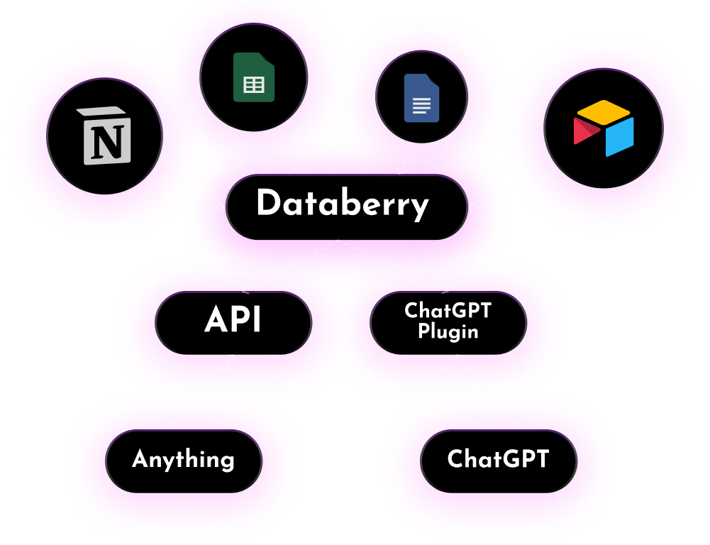

<h1 align="center" style="font-weight: bold">
   
  
   
  Databerry
   
    <h3 align="center">Connect your data to large language models!</h3>
   
  
</h1>

<!-- <h4 align="center">The no-code platform for semantic search and retrieval of personal or organizational documents.</h4> -->

<h2 align="center">

</h2>

**[Databerry](https://databerry.ai)** provides a user-friendly solution to quickly setup a semantic search system over your personal data without any technical knowledge.

### Features
- Load data from anywhere
  - Raw text
  - Web page
  - Files
    - Word
    - Excel
    - Powerpoint
    - PDF
    - Mardown
    - Plain Text
  - Web Site (coming soon)
  - Notion (coming soon)
  - Airtable (coming soon)
- No-code: User-friendly interface to manage your datastores and chat with your data
- Securized API endpoint for querying your data
- Auto sync data sources (coming soon)
- **Auto generates a ChatGPT Plugin** for each datastore

### Semantic Search Specs
- Vector Datbase: Qdrant
- Embeddigs: Openai's text-embedding-ada-002
- Chunk size: 256 tokens

### Stack
- Next.js
- Joy UI
- LangchainJS
- PostgreSQL
- Prisma
- Qdrant

Inspired by the [ChatGPT Retrieval Plugin](https://github.com/openai/chatgpt-retrieval-plugin).