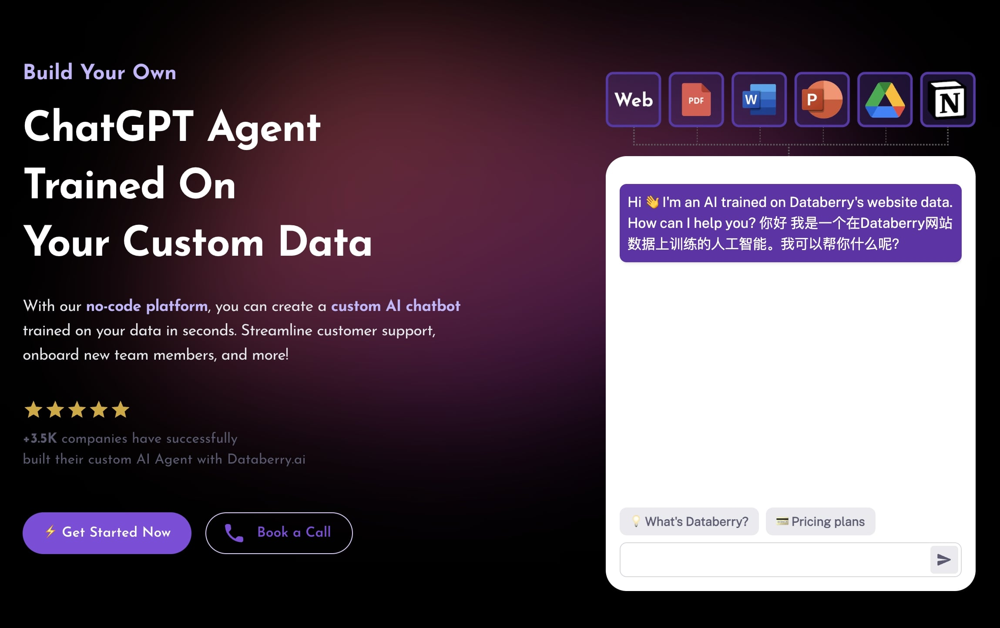

<h1 align="center" style="font-weight: bold">
  <br>
  <a href="https://chaindesk.ai"></a>
  <br>
  Chaindesk
  <br>
    <h3 align="center">The no-code platform for building custom LLM Agents</h3>
  <br>
  
</h1>

<!-- <h4 align="center">The no-code platform for semantic search and retrieval of personal or organizational documents.</h4> -->

<h2 align="center">

</h2>

**[Chaindesk](https://chaindesk.ai)** provides a user-friendly solution to quickly setup a semantic search system over your personal data without any technical knowledge.

### [📄 Documentation](https://docs.chaindesk.ai/)

### Features

- Load data from anywhere
  - Raw text
  - Web page
  - Files
    - Word
    - Excel
    - Powerpoint
    - PDF
    - Markdown
    - Plain Text
  - Web Site (coming soon)
  - Notion (coming soon)
  - Airtable (coming soon)
- No-code: User-friendly interface to manage your datastores and chat with your data
- Securized API endpoint for querying your data
- Auto sync data sources (coming soon)
- **Auto generates a ChatGPT Plugin** for each datastore

### Semantic Search Specs

- Vector Database: Qdrant
- Embeddings: Openai's text-embedding-ada-002
- Chunk size: 1024 tokens

### Stack

- Next.js
- Joy UI
- LangchainJS
- PostgreSQL
- Prisma
- Qdrant

Inspired by the [ChatGPT Retrieval Plugin](https://github.com/openai/chatgpt-retrieval-plugin).

### Run the project locally

#### Without docker compose

Minimum requirements to run the projects locally

- Node.js v18
- Postgres Database
- Redis
- Qdrant
- GitHub App (NextAuth)
- Email Provider (NextAuth)
- OpenAI API Key
- AWS S3 Credentials

<!-- ```bash
# Create .env.local
cp .env.example .env.local

# Install dependencies
pnpm install

# Generate DB tables
pnpm prisma:migrate:dev

# Run server
pnpm dev

# Run worker process
pnpm worker:datasource-loader

# or pnpm dev:all
``` -->

<!-- #### With docker compose -->

<!-- First `cd .dev/databerry` then populate the config files `app.env` and `docker.env` as needed, then run the compose command: -->

### Run locally (Docker required)

```shell
cp .env.example .env.local
# Add your own OPENAI_API_KEY

pnpm dev

# pupeteer browser local
brew install chromium --no-quarantine

# Dev emails inbox (maildev)
# visit http://localhost:1080
```
